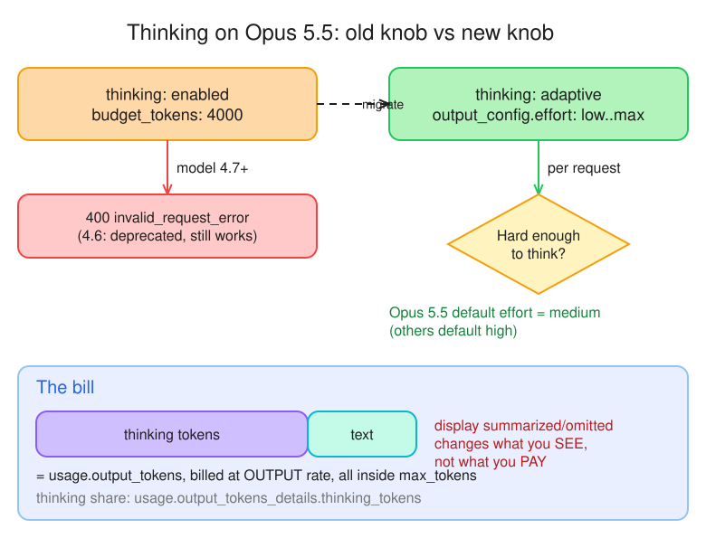

# W1 · D2 — Pick the model: tiers, effort, thinking and tokens

> **Hook:** Haiku, Sonnet or Opus, and at what effort? **Which model triages an alert well enough, fast enough, for the least money, and how do you prove it?**

| | |
|---|---|
| **Phase** | CCDV-F Week 1 — The API layer (Domain 5: Model Selection and Optimization) |
| **Date** | 2026-10-05 |
| **Time box** | 85–100 min · est. spend $0.30–$1.50 · no GPU |
| **Deliverable** | This file: model · effort · quality · p50 latency · $ per 100 alerts, plus ADR-001 |

---

## 🎲 Bets (placed before reading)

| Bet | Question | My bet | Correct answer | Result |
|---|---|---|---|---|
| **A** | Default effort of `claude-opus-5-5` with no `output_config.effort`? | **medium** | **medium**: Opus 5.5 is the one model that defaults below `high` | ✅ Win ([Effort](https://platform.claude.com/docs/en/build-with-claude/effort#effort-levels)) |
| **B** | `thinking: {"type": "enabled", "budget_tokens": 4000}` on `claude-opus-5-5`? | **Thinks for up to 4,000 tokens** | **400 error**: 4.7+ rejects `type: enabled` + `budget_tokens` | ❌ Lost: logged in gap-log |

---

## Progress

- [x] **M0** Place bets
- [x] **M1** The lineup and how to choose
- [x] **M2** Effort and thinking
- [x] **M3** Tokens and the context window
- [ ] ☕ 5-min break
- [x] **M4** Run the model shoot-out (`scripts/compare_models.py` → `notes/d02-runs.csv`)
- [x] **M5** Grade and decide (ADR-001)
- [ ] **M6** Commit + tick Day 2

---

## 1. The lineup

**Source:** [Models overview → Compare models](https://platform.claude.com/docs/en/about-claude/models/overview#compare-models) (checked 2026-10-05)

| | Fable 5.1 | Opus 5.5 | Sonnet 5.5 | Haiku 4.5 |
|---|---|---|---|---|
| **API ID** | `claude-fable-5-1` | `claude-opus-5-5` | `claude-sonnet-5-5` | `claude-haiku-4-5-20251001` |
| **$ / MTok in · out** | $10 · $50 | $4 · $20 | $2 · $10 | $1 · $5 |
| **Context** | 1M | 1M | 1M | **200K** |
| **Max output** | 128K | 128K | 128K | **64K** |
| **Thinking** | Adaptive, always on | Adaptive, always on | Adaptive | **Extended** (budget) |
| **Default effort** | high | **medium** | high | no effort param |
| **Latency** | Slower | Moderate | Fast | Fastest |

> ⚠️ **Plan drift:** the Day 2 plan says Sonnet 5 (`claude-sonnet-5`). The docs now list **Sonnet 5.5** (`claude-sonnet-5-5`), same price. The shoot-out uses `claude-sonnet-5-5`. This is objective 5.3 in action: pin IDs in config and re-check them.

**How to choose** ([Choosing a model](https://platform.claude.com/docs/en/about-claude/models/choosing-a-model#choose-the-best-model-to-start-with)):

- **Efficiency-first:** start on Haiku 4.5 and upgrade only when evals show a capability gap. Use for prototypes, tight latency and high-volume simple work.
- **Capability-first:** start on Opus 5.5, then **lower effort or downgrade** until quality drops. Go to Fable 5.1 only if Opus at high effort falls short.
- **Matrix:**
  - Fable 5.1 for the highest capability.
  - Opus 5.5 for complex agentic and enterprise work.
  - Sonnet 5.5 for everyday speed plus capability.
  - Haiku 4.5 for the lowest latency and price, high volume and **sub-agents**.

**Breaking changes so far (obj. 5.3):** prefill → 400 on 4.6+ · sampling params unsupported on 4.7+ · `budget_tokens` rejected on 4.7+ (see §2).

## 2. Effort and thinking


*Editable source: [`d02-thinking.excalidraw`](./d02-thinking.excalidraw)*

**Effort** ([Effort levels](https://platform.claude.com/docs/en/build-with-claude/effort#effort-levels))

- `output_config.effort`: `low` · `medium` · `high` · `xhigh` · `max`
- Default is **`high`** on Fable, Sonnet 5.5/5/4.6 and Opus 5–4.6, but **`medium` on Opus 5.5**.
- It's a **behavioral signal, not a hard budget.** It shapes **all** output: text, tool calls and their arguments, and thinking. At low effort Claude still thinks on hard problems, just less.
- Lower effort makes fewer, combined tool calls, skips the preamble and gives terse confirmations. `low` suits sub-agents.
- Haiku 4.5 has **no** effort parameter.

**Thinking modes** ([Extended thinking → Supported models](https://platform.claude.com/docs/en/build-with-claude/extended-thinking#supported-models))

| Generation | `type: "enabled"` + `budget_tokens` |
|---|---|
| ≤ 4.5 (incl. Haiku 4.5) | The only mode, and it works |
| 4.6 | Deprecated, still succeeds |
| **4.7+ (Opus 5.5, Sonnet 5.5, Fable 5.1)** | **400 error** |

- `budget_tokens`: minimum **1,024**, and it must be **< `max_tokens`** (except with interleaved thinking).
- **Migration:** drop `budget_tokens`, set `thinking: {"type": "adaptive"}` and steer depth with `output_config: {"effort": ...}`. A fixed budget forces thinking on every request; adaptive decides per request.

```python
# before (400 on Opus 5.5)
client.messages.create(
    model="claude-opus-5-5",
    max_tokens=16000,
    thinking={"type": "enabled", "budget_tokens": 4000},
    messages=msgs,
)

# after
client.messages.create(
    model="claude-opus-5-5",
    max_tokens=16000,
    thinking={"type": "adaptive"},
    output_config={"effort": "high"},
    messages=msgs,
)
```

**Cost** ([Steering thinking and cost → Pricing](https://platform.claude.com/docs/en/build-with-claude/thinking-steering-and-cost#pricing))

- Thinking tokens are **billed as output** and count toward **`max_tokens`**, which is a hard cap on thinking plus text, so leave room for both.
- Read the thinking share from `usage.output_tokens_details.thinking_tokens`; it's always ≤ `output_tokens`.
- `display: "summarized"` / `"omitted"` changes **what you see, not what you pay**: you pay for the full raw thinking.
- Earlier thinking blocks left in context are re-billed as **input**.

**Parking-lot lead (Day 1, turn 3: ~86 output tokens for 5 words):** the likely cause is thinking tokens, which are counted in `output_tokens` but aren't the visible text. M4 tests it by logging `output_tokens_details.thinking_tokens`.

## 3. Tokens and the context window

**What fills the window** ([Context windows](https://platform.claude.com/docs/en/build-with-claude/context-windows)): *everything*.

- System prompt
- All `messages`: user and assistant turns, **tool results**, images and documents
- **Tool definitions**
- Thinking blocks
- The output Claude generates this turn

More tokens is not free quality: accuracy and recall degrade as the window fills ("context rot"), so curate what you send.

**Overflow behavior** ([Context window overflow behavior](https://platform.claude.com/docs/en/build-with-claude/context-windows#context-window-overflow-behavior))

| Situation | Result |
|---|---|
| **Input alone** > window | **400 `invalid_request_error`** ("prompt is too long"), on every model |
| Input is valid, but input + `max_tokens` > window | **4.5 and newer:** the request is accepted and generation **stops** with `stop_reason: "model_context_window_exceeded"` |
| Same, on earlier models | Validation error (unless you opt in with beta header `model-context-window-exceeded-2025-08-26`) |

Handle it in code: a 400 means shrink the prompt (retrying won't help), while `model_context_window_exceeded` means the answer was cut short and you must check for it.

**Counting tokens** ([Token counting](https://platform.claude.com/docs/en/build-with-claude/token-counting#pricing-and-rate-limits))

```python
n = client.messages.count_tokens(
    model="claude-opus-5-5", system=SYSTEM, messages=msgs
).input_tokens
```

- **Free**, with its own rate limit (5,000 / 10,000 / 20,000 requests per minute for the Start / Build / Scale tiers), separate from message creation.
- The result is an **estimate**. It may include system-added tokens that you aren't billed for.
- **4.7+ tokenizer ≈ 30% more tokens** for the same text, so recount against the model you'll actually use. Haiku 4.5 and Opus 5.5 will count the same alert differently, which M4's `est_in` vs `in` columns should show.
- Returns `invalid_request_error` for server tools, the MCP connector, and `image`/`document` blocks with `url` or `file` sources (use base64).

**Twist: non-determinism without temperature** (obj. 5.1). Sampling parameters are unsupported on 4.7+, so you can't turn randomness down. The same prompt can return different wording. Engineer for it with structured outputs, validation, and evals that run each case more than once.

## 4. Shoot-out results

40 calls (4 configs × alerts ALRT-0001..0010), `scripts/compare_models.py` → `notes/d02-runs.csv`. One run per case, so treat small gaps as noise (see §3: no temperature control on 4.7+).

| Model | Effort | Mean quality (1–5) | p50 latency (s) | Mean output tokens | Mean thinking tokens | $ per 100 alerts |
|---|---|---|---|---|---|---|
| claude-haiku-4-5-20251001 | n/a | **3.0** | 1.44 | 78 | 0 | $0.06 |
| claude-sonnet-5-5 | low | **4.7** | 2.77 | 210 | 0 | $0.25 |
| claude-sonnet-5-5 | high | **4.6** | 2.77 | 196 | 0 | $0.24 |
| claude-opus-5-5 | default (medium) | **5.0** | 4.54 | 320 | 132 | $0.72 |

**What the numbers show**

- **Cost and speed climb with the tier:** Opus costs about **12×** Haiku per alert and is about **3×** slower. Sonnet sits at about 4× and 2×.
- **Sonnet `low` vs `high` made no measurable difference** (same p50, similar output, **0 thinking tokens** in both). With no `thinking` parameter set, Sonnet 5.5 didn't think on these short alerts, so effort had little to shape. Don't assume the effort knob always moves cost: measure it, and test again with `thinking: {"type": "adaptive"}` on.
- **Opus thought on every alert** (58–199 thinking tokens, about 40% of its output), matching the docs' "adaptive, always on". That is billed as output, so it's a big part of why Opus costs more.
- **Token estimates:** `est_in` equalled the real `in` on every row. The same alert counted **177 tokens on Haiku 4.5 but 224 on Sonnet 5.5/Opus 5.5**, about 27% more, which matches the "about 30% more on the 4.7+ tokenizer" from §3.
- **Day 1 parking lot (86 tokens for a 5-word reply):** *not* explained by thinking on Sonnet, since Sonnet showed 0 thinking tokens here. Still open, so I'll print the content block types in a follow-up.

### How it was graded

**Graded by Claude, not by you** (you asked me to grade all 40), so treat it as a first pass and spot-check the Haiku misses below. Each answer was scored 1–5 against the alert's own `rule` and narrative:

- **5**: right typology, risk proportionate to the facts, no invented facts, and it catches data anomalies or gives a concrete next step.
- **4**: right, but generic, speculative or missing a next step.
- **3**: mislabelled typology or a risk level that doesn't fit.
- **2**: factual error or a wrong, overcalled risk.

**Grades by alert** (Haiku · Sonnet low · Sonnet high · Opus):

| Alert | Rule | Grades | Note |
|---|---|---|---|
| 0001 | structuring | 4 · 5 · 5 · 5 | all rated high |
| 0002 | rapid_movement | 3 · 4 · 5 · 5 | alert amount ≈ in + out; Opus and Sonnet-high caught it |
| 0003 | high_risk_corridor | 2 · 4 · 4 · 5 | **Haiku read "MT" as Mongolia (it's Malta)** |
| 0004 | large_cash | 3 · 5 · 4 · 5 | Haiku called a single deposit "structuring" |
| 0005 | dormant_reactivation | 3 · 5 · 5 · 5 | Haiku under-called it |
| 0006 | round_amounts | 2 · 5 · 4 · 5 | **Haiku called the Netherlands a higher-risk jurisdiction** |
| 0007 | third_party_funding | 4 · 5 · 4 · 5 | |
| 0008 | structuring | 4 · 4 · 5 · 5 | Opus and Sonnet-high cite FINTRAC's 24-hour rule |
| 0009 | rapid_movement | 2 · 5 · 5 · 5 | **Haiku rated a US→CA pass-through "high"** |
| 0010 | high_risk_corridor | 3 · 5 · 5 · 5 | Haiku overcalled one $15K wire as high |

**Pattern:** Haiku's failures are the costly kind for AML: it invents or mislabels facts (Mongolia, "structuring" on a single deposit) and **overcalls risk** (alerts 0009 and 0010 high, where the others said medium). The other three give near-identical answers; Opus's edge is catching anomalies (e.g., the plural "wires" with one transaction ID on alert 0010).

**Cost per quality point:** Haiku $0.06 for 3.0 · Sonnet low $0.25 for 4.7 · Opus $0.72 for 5.0. The jump from Haiku to Sonnet buys 1.7 points for about $0.19 more; Sonnet to Opus buys 0.3 points for about $0.47 more.

## ADR-001 Model per task

**Status:** accepted for the lab, to be re-tested (see below). **Date:** 2026-10-05. **Evidence:** 40 calls on 10 synthetic alerts, one run each, graded by Claude (§4).

| Model · effort | Mean quality | p50 latency | $ per 100 alerts |
|---|---|---|---|
| Haiku 4.5 | 3.0 | 1.44s | $0.06 |
| Sonnet 5.5 · low | 4.7 | 2.77s | $0.25 |
| Sonnet 5.5 · high | 4.6 | 2.77s | $0.24 |
| Opus 5.5 · default (medium) | 5.0 | 4.54s | $0.72 |

**Decisions (yours)**

| Workload | Model | Effort | Why (from the numbers) |
|---|---|---|---|
| Bulk overnight triage | Sonnet 5.5 | `low` | 4.7/5 at $0.25 per 100. Nobody waits, so Opus's extra 0.3 points isn't worth about 3× the cost. `high` gave no gain over `low`. |
| Analyst-facing chat | Sonnet 5.5 | `low` | 2.8s fits an interactive reply, and quality stays at 4.7. Opus is 4.5s with thinking on every turn. |
| Hard investigation | Opus 5.5 | default (medium); raise to `high` if needed | Best at catching data anomalies (e.g. the amount mismatch and the "wires" vs one transaction ID). Cost matters little for a single case. Fable 5.1 only if Opus at higher effort falls short. |
| Pre-screening classifier | Haiku 4.5 | n/a (no effort parameter) | Cheapest and fastest. It **only routes** to a bigger model and **never closes an alert**: its failures (invented facts, overcalled risk) cost an extra escalation, not a missed case. |

**Why not Haiku for triage:** it invented a country (Malta read as Mongolia), mislabelled typologies, and overcalled two medium alerts as high. In financial crime, wrong facts in a rationale an analyst may trust cost more than the $0.19 per 100 saved.

**Switch if**

- Haiku's *under*-calls on a larger set (it rated alert 0005 medium where the others said high) are more than a few percent: then it can't be the router, because under-calling is the dangerous direction.
- Sonnet low's quality drops on harder alerts, or analysts reject its rationales: raise effort or move those cases to Opus.
- Volume grows enough that Opus's cost per escalated case dominates the bill.

**Re-test when a new model ships** (objective 5.3): pin model IDs in config, rerun `compare_models.py` on a bigger, harder alert set with 3 runs per case (no temperature control on 4.7+), recount tokens on the new tokenizer, and check for breaking changes (prefill, sampling parameters, `budget_tokens`). Also test Sonnet with `thinking: {"type": "adaptive"}` on, since effort changed nothing with thinking off.

**Caveats:** 10 alerts, one run each, graded by a model, and the alerts are synthetic and short. Treat the ranking as a hypothesis, not a result.

---|---|---|---|
| Bulk overnight triage | | | |
| Analyst-facing chat | | | |
| Hard investigation | | | |
| Pre-screening classifier | | | |

**Switch if:**

**Re-test when a new model ships:**

---

## 🅿️ Parking lot (from Day 1)

- Turn 3 of `hello.py`: ~86–90 output tokens for a 5-word reply. Thinking tokens? → answered in §2.

## Reflection

- Where did a cheaper configuration match the expensive one, and where did it clearly lose?
- Which triage decisions would you never route to the cheapest model, whatever the evals say?

## ✅ Done when

- [x] This file has the comparison table and ADR-001
- [x] Can pick model + effort for bulk overnight, analyst chat and hard investigation, defended with numbers
- [x] Can explain adaptive thinking vs `budget_tokens`, and where thinking tokens show up in the bill
